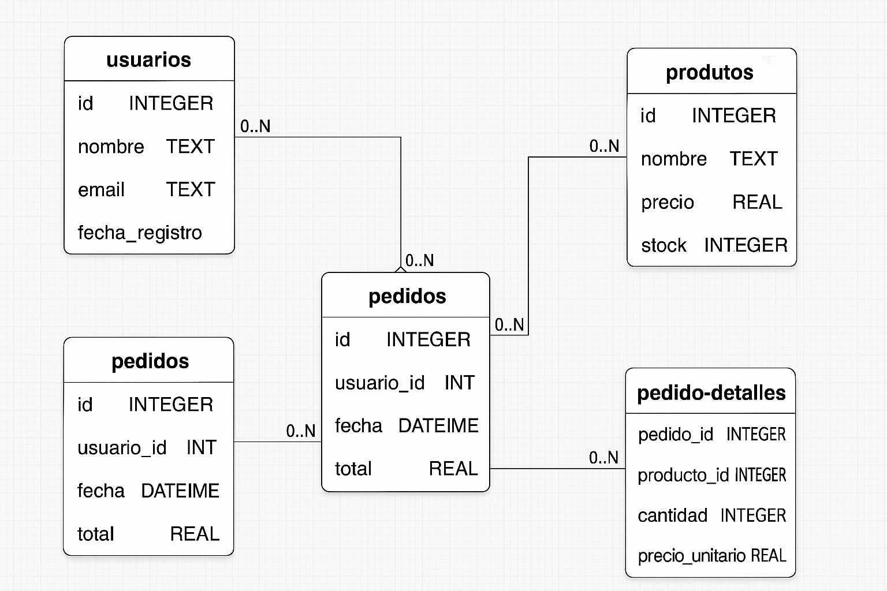

# 🗃️ Modelo de Datos

Este documento describe la estructura de la base de datos utilizada en el proyecto.

## 📋 Esquema general

La base de datos está compuesta por las siguientes tablas principales:

### 1. `usuarios`
Contiene la información básica de los usuarios registrados.

| Campo         | Tipo        | Descripción                       |
|---------------|-------------|-----------------------------------|
| `id`          | INTEGER     | Clave primaria, autoincremental   |
| `nombre`      | TEXT        | Nombre completo del usuario       |
| `email`       | TEXT        | Correo electrónico, único         |
| `fecha_registro` | DATETIME | Fecha de registro                 |

---

### 2. `productos`
Registra los productos disponibles en la plataforma.

| Campo         | Tipo     | Descripción                          |
|---------------|----------|--------------------------------------|
| `id`          | INTEGER  | Clave primaria, autoincremental      |
| `nombre`      | TEXT     | Nombre del producto                  |
| `precio`      | REAL     | Precio en euros                      |
| `stock`       | INTEGER  | Unidades disponibles                 |

---

### 3. `pedidos`
Representa los pedidos realizados por los usuarios.

| Campo         | Tipo     | Descripción                                 |
|---------------|----------|---------------------------------------------|
| `id`          | INTEGER  | Clave primaria, autoincremental             |
| `usuario_id`  | INTEGER  | Clave foránea a `usuarios(id)`              |
| `fecha`       | DATETIME | Fecha del pedido                            |
| `total`       | REAL     | Total en euros                              |

---

### 4. `pedido_detalles`
Relación muchos-a-muchos entre `pedidos` y `productos`.

| Campo         | Tipo     | Descripción                                 |
|---------------|----------|---------------------------------------------|
| `pedido_id`   | INTEGER  | Clave foránea a `pedidos(id)`               |
| `producto_id` | INTEGER  | Clave foránea a `productos(id)`             |
| `cantidad`    | INTEGER  | Número de unidades del producto             |
| `precio_unitario` | REAL | Precio del producto en el momento del pedido |

---

## 🔄 Relaciones entre tablas

- Un `usuario` puede tener muchos `pedidos`.
- Un `pedido` puede incluir muchos `productos` (a través de `pedido_detalles`).
- Un `producto` puede estar en muchos `pedidos`.

---

## 🖼️ Diagrama visual

> ToDo: Este diagrama se incluirá en `docs/diagrama_modelo_datos.png`.

---

